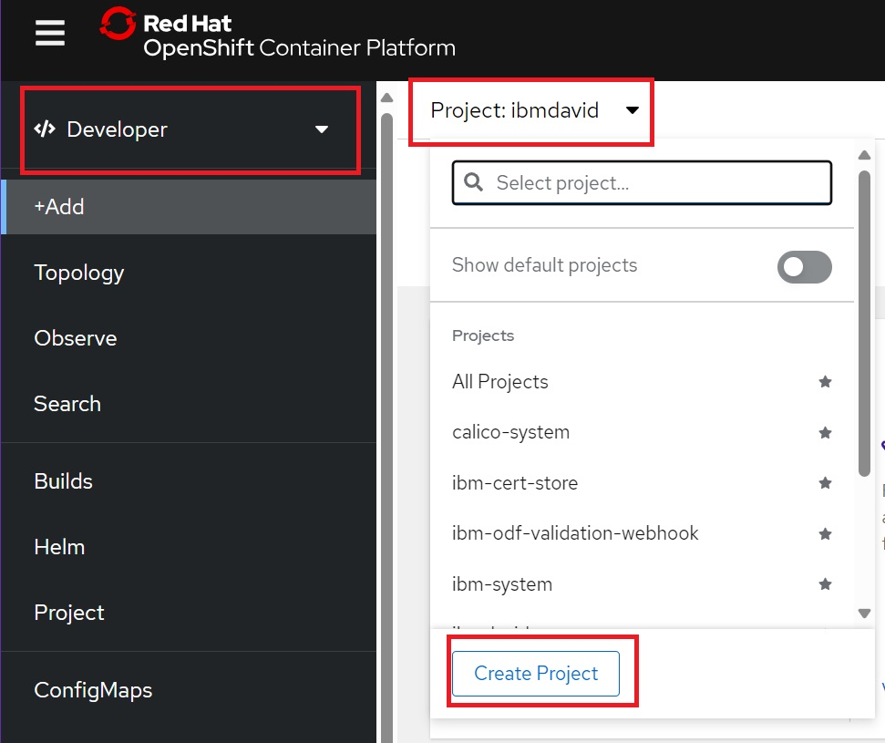
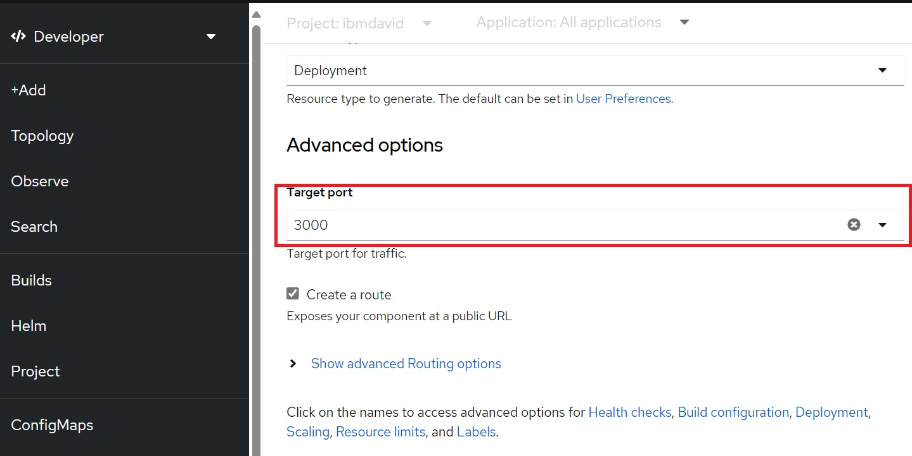

# ROKS-NextJS-React-Framework
Para el desarrollo de esta guia de despliegue, se tiene como base el desarrollo de una aplicación basada en la librería NextJS de javascript y su posterior despliegue en un Cluster de OpenShift que se encuentra alojado en IBM Cloud.
 
## Indice 
 

## Pre-requisitos
 
Para que la aplicación se despliegue en el cluster de OpenShift, se necesita de un archivo de configuración, siendo compatibles dockerfile, yaml y devfile. Un ejemplo de archivo dockerfile para NextJS se encuentra en el siguiente repositorio: https://github.com/davidravelo1/Pokemon-Ecommerce-.git.

## Despliegue la consola web de OpenShift desde IBM Cloud  

1. Asegurese de encontrarse en la cuenta en la cual va a desplegar la aplicación, posteriormente, ingrese a **Resource list** y posteriormente a **Containers**, debe tener **activa** la instancia de openshift.

 

2. Ingrese a la instancia de openshift y de click en **OpenShift web console**.

 

## Despliegue aplicación de NextJs en OpenShift

1. Dentro de la instancia, cambie de administrador a developer. Posteriormente, en proyect, cree un nuevo proyecto.

 

2. En el proyecto creado, ingrese a la pestaña +Add y seleccione la opción de importar desde repositorio de GitHub.

 

3. Ingrese el link del repositorio de la aplicación en GitHub.

 

4. Seleccione la opción de editar la estrategia de importación.

 

5. Cambie la estrategia a la que posea, escriba la ruta del archivo junto con el nombre.
(ejemplo dockerfile)

 

6. En opciones avanzadas, cambie el puerto a 3000.

 

7. Encima del boton create, seleccione la opción de Scaling, en caso de querer cambiarla. 

 

8. Seleccione la cantidad de replicas que quiere de su aplicación.

 

9. Presione el boton Create y empezara el proceso de build del pod.

 

10. Cuando el proceso de build termine, despliegue la aplicación de la siguiente manera: 

 

Aplicación NextJs desplegada: 

 

